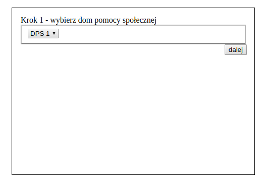
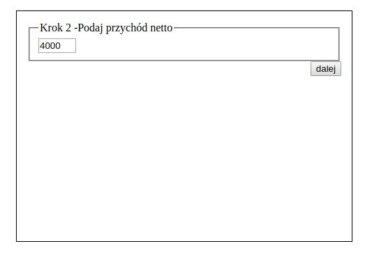
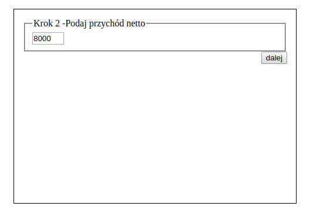
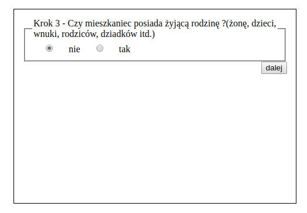
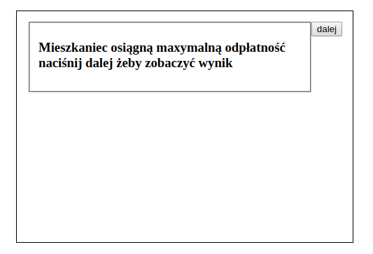
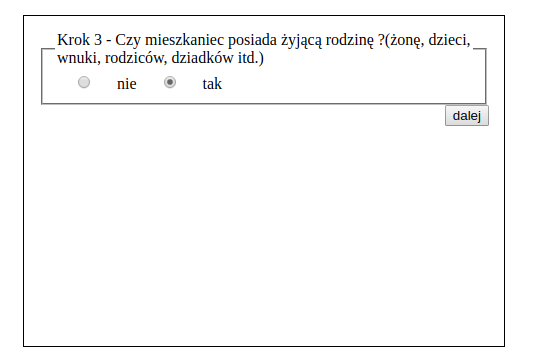
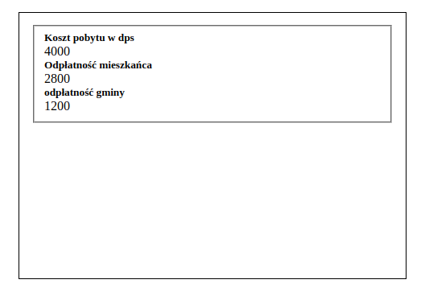
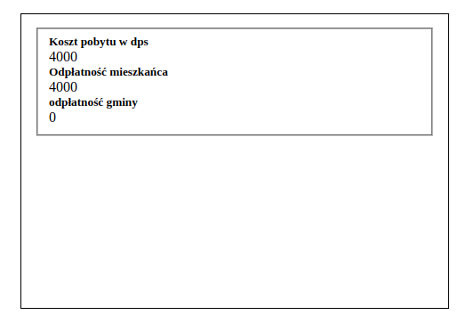
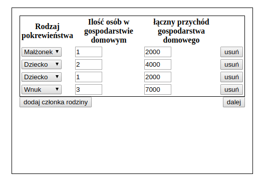
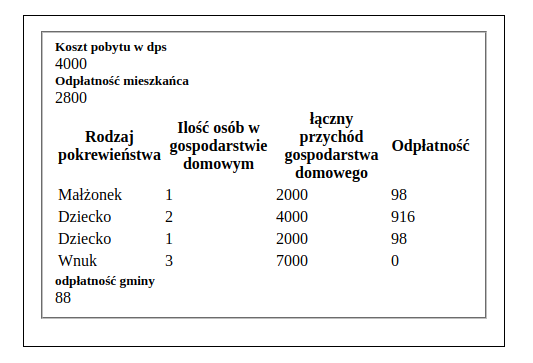

# mopr
Ta aplikacja służy do obliczania kosztów pobytu w polskich Domach Pomocy Społecznej na terenie danej gminy.Jest to dosyć skomplikowane zagadnienie bo koszt pobytu jest rozkładany na mieszkańca, jego rodzine (wstępni przed wstępnymi), oraz gminę w której zamieszkiwał przed pobytem w DPS.
### [Demo](http://rogala.it/mopr/)

## Budowanie aplikacji
[Install gulp](https://github.com/leszek3737/Gulp-Config-Files)
and install:
```
npm install
```
Budowanie aplikacji w wersji developerskiej 

```
gulp build
```
Budowanie aplikacji w wersji produkcyjnej

```
gulp build::prod
```

## Screen
| Zkaończnie 1 | Zakończnie 2 | Zakończnie 3 |
| :---: | :-: | :-: |
|   |    |   |
|   |   |   |
|   |   |   |
|  |   |   |
|                                   |                                    |   |
